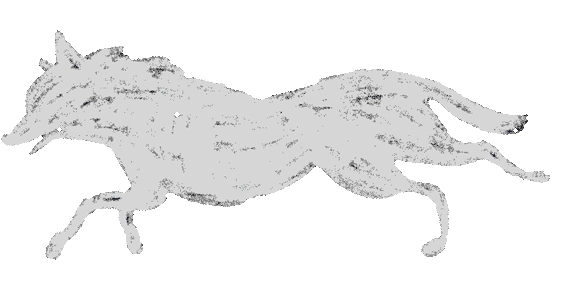

  <!-- Banner-->
  

<!-- Social Media-->

  

   

   

<h3> Front-End Developer | Full-Stack Capable</h3>
<h3> B.Sc. IT Student (Web Development)</h3>
 <h3> Modern, High-Performance Web Applications</h3>

   

<h2 align="center"> Tech stack</h2>

  
  
  
  
  
  
  
  
  
  
    
  
  
    
  
  

 

  

  

